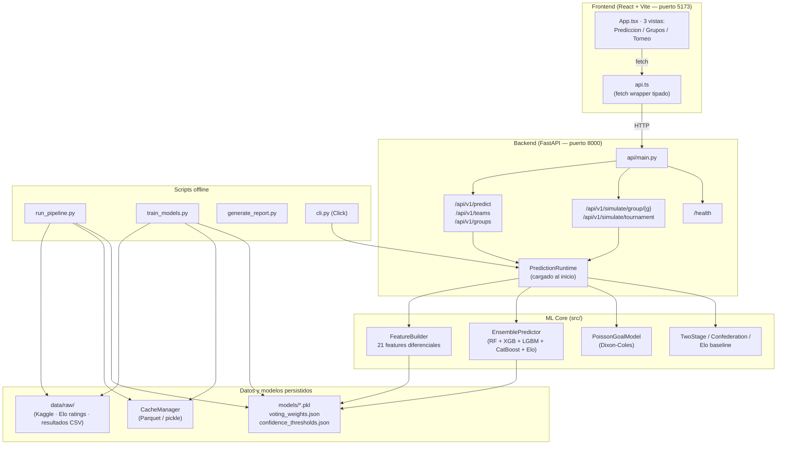
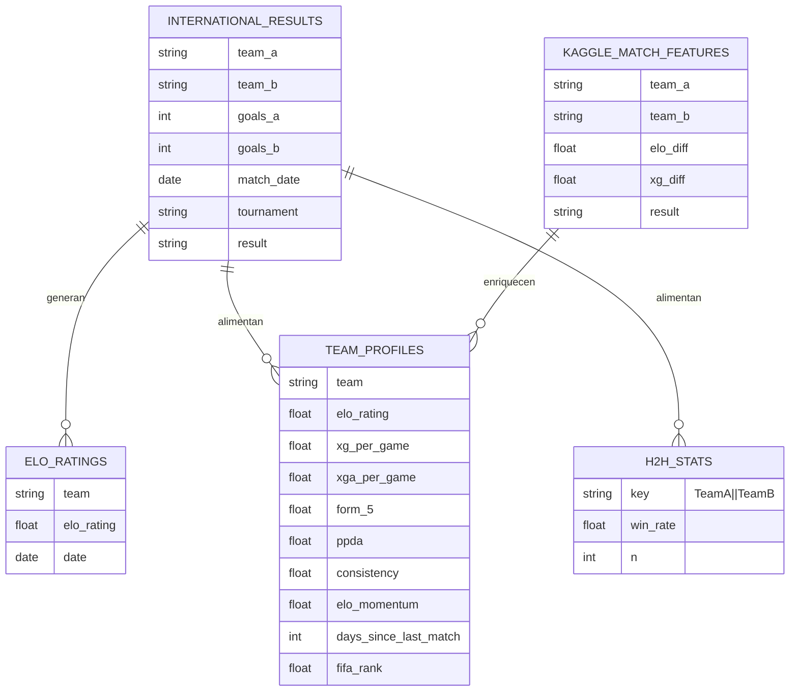

# prode-ML — Documentación Técnica

> Sistema de predicción para el FIFA World Cup 2026 mediante Machine Learning.
> Cubre backend (Python/FastAPI), frontend (React/Vite) y pipeline ML completo.

---

## 1. Descripción general

**prode-ML** es un sistema de predicción deportiva construido para el Mundial FIFA 2026.
Permite predecir resultados de partidos individuales, simular la fase de grupos y simular
el torneo completo utilizando un ensemble de modelos de clasificación entrenado sobre
datos históricos de selecciones nacionales (2000–2026).

**Usuarios objetivo:** uso personal/analítico. No requiere autenticación.

**Flujo principal de uso:**

```
[Usuario] → elige dos selecciones en el Frontend
          → el Frontend llama POST /api/v1/predict
          → el Backend aplica el FeatureBuilder y el EnsemblePredictor
          → devuelve probabilidades win/draw/loss + marcador más probable + SHAP
          → el Frontend renderiza las probabilidades, xG, scorelines y features

[Pipeline offline, una sola vez]
  run_pipeline.py → recolecta datos (Elo, Kaggle, resultados internacionales)
  train_models.py → entrena RF + XGB + LGBM + CatBoost + Poisson + auxiliares
  generate_report.py → exporta PDF con predicciones de todo el torneo
```

**Diagrama de arquitectura:**



---

## 2. Arquitectura general

### Patrón

**Pipeline + Service Object.** No hay ORM de dominio ni Clean Architecture formal.
La separación de responsabilidades es funcional:

| Capa | Responsabilidad |
|------|----------------|
| `config/` | Constantes, rutas, pesos, aliases de equipos |
| `src/data/` | Recolección y caché de datos crudos |
| `src/features/` | Ingeniería de features (sin estado de entrenamiento) |
| `src/models/` | Entrenamiento, serialización y predicción de modelos |
| `src/simulation/` | Simulaciones Monte Carlo de grupos y torneo |
| `src/runtime.py` | Objeto `PredictionRuntime` que glue todo para inferencia |
| `api/` | Capa HTTP (FastAPI), sin lógica de negocio propia |
| `scripts/` | Orquestadores de pipeline (colección, entrenamiento, reporte) |
| `frontend/` | Visualización React, sin estado global complejo |

### Decisiones de separación clave

- **`PredictionRuntime`** es el único objeto que la API instancia al arrancar. Contiene
  todos los modelos ya cargados en memoria. Los routers lo reciben por inyección de
  dependencias (`Depends(get_runtime)`).
- **`FeatureBuilder`** no depende de datos de entrenamiento: sólo combina perfiles de
  equipo y features estáticas para construir el vector diferencial de 21 dimensiones.
- **Scripts** son independientes entre sí y del servidor web.

---

## 3. Backend

### 3.1 Estructura de carpetas

```
api/
├── main.py                # App FastAPI, CORS, lifespan
├── dependencies.py        # load_models_on_startup / get_runtime
├── schemas.py             # Modelos Pydantic (request + response)
└── routers/
    ├── health.py          # GET /health
    ├── predictions.py     # GET /teams, /groups · POST /predict
    └── simulation.py      # GET /simulate/group/{g}, /simulate/tournament

config/
├── settings.py            # Paths, umbrales, constantes de entrenamiento
├── wc2026_groups.py       # Grupos oficiales WC2026, confederaciones, WC history score
├── team_aliases.py        # Alias de nombres de equipo → nombre canónico
└── feature_weights.py     # Pesos auxiliares de features

src/
├── runtime.py             # PredictionRuntime · load_prediction_runtime · predict_match
├── data/
│   ├── cache_manager.py   # Caché Parquet/pickle con TTL de 72 h
│   ├── validators.py      # Validaciones de integridad de datos
│   ├── national_team_proxy.py  # Estadísticas y valores de mercado hardcoded de las 48 selecciones
│   ├── pipeline.py        # DataPipeline (orquesta colectores)
│   └── collectors/
│       ├── kaggle_collector.py          # Dataset Kaggle (7702 partidos)
│       ├── eloratings_collector.py      # Ratings Elo históricos
│       ├── elo_history_collector.py     # Cómputo de Elo propio desde resultados
│       ├── international_results_collector.py  # CSV resultados internacionales
│       ├── fbref_collector.py           # Stats de clubes de ligas top (proxy)
│       ├── understat_collector.py       # xG de ligas top
│       └── sofifa_collector.py          # Ratings de jugadores SoFIFA
├── features/
│   ├── feature_builder.py   # FeatureBuilder · build_match_features (21 dims)
│   ├── elo_features.py      # get_elo_rating · compute_elo_win_probability
│   ├── attack_features.py   # compute_offensive_power
│   ├── defense_features.py  # compute_defensive_stability
│   ├── squad_features.py    # compute_squad_depth_from_market_value
│   ├── historical_features.py  # compute_world_cup_history_score · h2h_advantage_score
│   ├── risk_features.py     # compute_upset_probability · compute_consistency_score
│   ├── form_features.py     # Rolling form (5 últimos partidos)
│   └── club_stats_builder.py   # Proxy selección ← estadísticas de clubes
├── models/
│   ├── ensemble.py          # EnsemblePredictor (weighted voting)
│   ├── trainer.py           # ModelTrainer (orquesta entrenamiento paralelo)
│   ├── rf_model.py          # RandomForestOutcomeClassifier
│   ├── xgb_model.py         # XGBOutcomeClassifier + SHAP explain()
│   ├── lgbm_model.py        # LGBMOutcomeClassifier
│   ├── catboost_model.py    # CatBoostOutcomeClassifier
│   ├── elo_model.py         # EloModel (baseline)
│   ├── poisson_model.py     # PoissonGoalModel (Dixon-Coles)
│   ├── two_stage.py         # TwoStageClassifier (draw/no-draw)
│   └── confederation_models.py  # ConfederationModels (6 modelos por confederación)
└── simulation/
    ├── match_simulator.py      # simulate_match (Poisson estocástico)
    ├── group_simulator.py      # GroupSimulator (Monte Carlo 12 grupos)
    └── tournament_simulator.py # TournamentSimulator (R32 → Final)

scripts/
├── run_pipeline.py          # Recolección de datos
├── download_enriched_data.py # Descarga datasets Kaggle enriquecidos
├── validate_data.py         # Validación de integridad
├── train_models.py          # Entrenamiento completo
├── tune_hyperparams.py      # Optuna (búsqueda de hiperparámetros)
├── run_simulation.py        # Simulación por CLI
└── generate_report.py       # Exportación PDF

models/                      # Artefactos serializados (no incluidos en git salvo .gitkeep)
├── *.pkl                    # Modelos entrenados (RF, XGB, LGBM, CatBoost, Poisson)
├── voting_weights.json      # Pesos del ensemble aprendidos en validación
├── confidence_thresholds.json
├── probability_calibrators.pkl  # Temperature scaling
├── inference_team_profiles.json
└── inference_h2h_stats.json

data/
├── raw/
│   ├── kaggle/              # database.sqlite, international_elo/, match_features/
│   ├── eloratings/          # Ratings históricos Elo
│   └── international/       # results.csv (resultados históricos)
└── processed/               # Caché Parquet generado por CacheManager
```

### 3.2 Endpoints / API

Prefijo base: `http://localhost:8000`

#### `GET /health`

| Campo | Valor |
|-------|-------|
| Auth | No requerida |
| Descripción | Estado del servicio y de los modelos cargados en memoria |

**Respuesta 200:**
```json
{
  "status": "ok",
  "models_loaded": true,
  "teams": 48
}
```

`status` puede ser `"degraded"` si ningún modelo base está entrenado.

---

#### `GET /api/v1/teams`

| Campo | Valor |
|-------|-------|
| Auth | No requerida |
| Descripción | Lista las 48 selecciones con su grupo WC2026, rating Elo y confederación |

**Respuesta 200:**
```json
{
  "teams": [
    {
      "name": "Argentina",
      "group": "J",
      "elo": 2043.5,
      "confederation": "CONMEBOL"
    }
  ]
}
```

---

#### `GET /api/v1/groups`

| Campo | Valor |
|-------|-------|
| Auth | No requerida |
| Descripción | Devuelve el fixture de grupos oficial WC2026 |

**Respuesta 200:**
```json
{
  "groups": {
    "A": ["Mexico", "South Africa", "South Korea", "Czechia"],
    "J": ["Argentina", "Austria", "Algeria", "Jordan"]
  }
}
```

---

#### `POST /api/v1/predict`

| Campo | Valor |
|-------|-------|
| Auth | No requerida |
| Content-Type | `application/json` |
| Descripción | Predice el resultado de un partido entre dos selecciones |

**Body:**
```json
{
  "team_a": "Argentina",
  "team_b": "France"
}
```

| Parámetro | Tipo | Requerido | Descripción |
|-----------|------|-----------|-------------|
| `team_a` | `string` | Sí | Nombre canónico o alias del equipo local |
| `team_b` | `string` | Sí | Nombre canónico o alias del equipo visitante |

**Respuesta 200:**
```json
{
  "team_a": "Argentina",
  "team_b": "France",
  "probabilities": {
    "win_a": 0.4321,
    "draw": 0.2415,
    "win_b": 0.3264
  },
  "expected_goals": {
    "team_a": 1.48,
    "team_b": 1.21
  },
  "confidence": "MEDIO",
  "most_likely_scoreline": { "goals_a": 2, "goals_b": 1, "probability": 0.0834 },
  "outcome_scoreline": { "goals_a": 2, "goals_b": 1, "probability": 0.0834 },
  "exact_most_likely_scoreline": { "goals_a": 1, "goals_b": 1, "probability": 0.0912 },
  "top_scorelines": [
    { "goals_a": 1, "goals_b": 1, "probability": 0.0912 },
    { "goals_a": 2, "goals_b": 1, "probability": 0.0834 }
  ],
  "upset_risk": 0.2341,
  "top_features": [
    { "name": "elo_diff", "value": 0.312, "direction": "Argentina" }
  ],
  "elo": { "team_a": 2043.5, "team_b": 2010.2, "diff": 33.3 },
  "model_breakdown": {
    "rf":       [0.42, 0.24, 0.34],
    "xgb":      [0.44, 0.23, 0.33],
    "lgbm":     [0.41, 0.25, 0.34],
    "catboost": [0.45, 0.22, 0.33],
    "elo":      [0.40, 0.25, 0.35]
  }
}
```

**Errores:**

| Código | Motivo |
|--------|--------|
| 400 | Equipo desconocido (no está en `TEAM_ALIASES`) |
| 503 | Error interno durante la predicción |

---

#### `GET /api/v1/simulate/group/{group_name}`

| Campo | Valor |
|-------|-------|
| Auth | No requerida |
| Descripción | Simula la fase de grupos mediante Monte Carlo (Poisson) |

**Path params:**

| Param | Tipo | Descripción |
|-------|------|-------------|
| `group_name` | `string` | Letra del grupo: A–L (case-insensitive) |

**Query params:**

| Param | Tipo | Default | Rango | Descripción |
|-------|------|---------|-------|-------------|
| `n_sims` | `int` | 10000 | 100–100000 | Número de iteraciones Monte Carlo |

**Respuesta 200:**
```json
{
  "group": "J",
  "n_sims": 10000,
  "results": [
    {
      "team": "Argentina",
      "group": "J",
      "prob_1st": 0.6812,
      "prob_2nd": 0.2341,
      "prob_3rd": 0.0721,
      "prob_4th": 0.0126,
      "qualify_direct_prob": 0.9153,
      "avg_pts": 7.12,
      "avg_gd": 4.21
    }
  ],
  "fixtures": [
    {
      "team_a": "Argentina",
      "team_b": "Jordan",
      "expected_goals": { "team_a": 2.1, "team_b": 0.8 },
      "most_likely_scoreline": { "goals_a": 2, "goals_b": 0, "probability": 0.14 }
    }
  ]
}
```

**Errores:**

| Código | Motivo |
|--------|--------|
| 400 | Grupo desconocido |

---

#### `GET /api/v1/simulate/tournament`

| Campo | Valor |
|-------|-------|
| Auth | No requerida |
| Descripción | Simula el torneo completo WC2026 (fase de grupos → final) |

**Query params:**

| Param | Tipo | Default | Rango | Descripción |
|-------|------|---------|-------|-------------|
| `n_sims` | `int` | 5000 | 100–100000 | Iteraciones Monte Carlo |
| `top_n` | `int` | 20 | 1–48 | Equipos a retornar en el ranking |

**Respuesta 200:**
```json
{
  "n_sims": 5000,
  "results": [
    {
      "team": "Argentina",
      "p_group_stage": 0.98,
      "p_round_32": 0.91,
      "p_round_16": 0.78,
      "p_quarterfinal": 0.62,
      "p_semifinal": 0.48,
      "p_finalist": 0.35,
      "p_champion": 0.22,
      "rank": 1
    }
  ]
}
```

---

### 3.3 Autenticación y autorización

No implementada. Todos los endpoints son públicos.
El CORS está abierto (`allow_origins=["*"]`) para facilitar el desarrollo local.

Si se desplegara en producción sería necesario restringir CORS al dominio del frontend
y agregar autenticación (API key o JWT) antes de exponer el endpoint `/predict` a internet.

---

## 4. Frontend

### 4.1 Estructura de carpetas

```
frontend/
├── index.html          # HTML shell (SPA)
├── vite.config.ts      # Vite config (puerto 5173, plugin React)
├── tsconfig.json       # TypeScript strict mode
├── package.json        # Dependencias: React 18, lucide-react, Vite 6, TypeScript 5
└── src/
    ├── main.tsx        # Punto de entrada + componentes React (toda la UI)
    ├── api.ts          # Funciones fetch tipadas + definición de tipos TypeScript
    ├── styles.css      # CSS global (layout, componentes, responsive)
    └── vite-env.d.ts   # Tipos de variables de entorno Vite
```

> La aplicación es un **single-file component**: toda la UI vive en `main.tsx`
> sin subdirectorio de componentes. Es intencionalmente compacta para un proyecto
> personal de esta escala.

### 4.2 Componentes principales

La aplicación es una SPA con una sola instancia de `ReactDOM.createRoot`.

#### `<App>`

Componente raíz. Gestiona toda la lógica de estado y navegación entre vistas.

| Estado | Tipo | Descripción |
|--------|------|-------------|
| `view` | `"predict" \| "groups" \| "tournament"` | Vista activa |
| `teams` | `TeamInfo[]` | Lista de selecciones cargada al iniciar |
| `groups` | `Record<string, string[]>` | Grupos WC2026 cargados al iniciar |
| `teamA` / `teamB` | `string` | Selecciones elegidas para predecir |
| `match` | `MatchResult \| null` | Última predicción recibida del backend |
| `groupName` | `string` | Grupo seleccionado para simular |
| `groupRows` | `GroupSimulationRow[]` | Tabla de posiciones simulada |
| `groupFixtures` | `GroupFixturePrediction[]` | Marcadores más probables por fixture |
| `tournamentRows` | `TournamentRow[]` | Ranking de campeones simulado |
| `loading` | `boolean` | Flag de carga para deshabilitar controles |
| `error` | `string \| null` | Mensaje de error global |

**Efectos:**
- Al montar: carga `fetchTeams()` + `fetchGroups()` en paralelo.
- Cuando `teams.length` cambia de 0 a >0: ejecuta la predicción por defecto (Argentina vs Jordan).

---

#### `<TeamSelect>`

Selector de equipo agrupado por confederación. Muestra nombre, grupo y Elo.

| Prop | Tipo | Descripción |
|------|------|-------------|
| `label` | `string` | Etiqueta del campo |
| `value` | `string` | Equipo seleccionado |
| `teams` | `TeamInfo[]` | Lista completa de selecciones |
| `onChange` | `(v: string) => void` | Callback al cambiar selección |

Genera `<optgroup>` por confederación (UEFA, CONMEBOL, CONCACAF, CAF, AFC, OFC).

---

#### `<PredictionPanel>`

Muestra los resultados de una predicción. Consume el objeto `MatchResult` completo.

Secciones renderizadas:
- **`result-band`**: resultado más probable + porcentaje de confianza.
- **`prob-panel`**: tres barras de probabilidad (win A / draw / win B).
- **`metrics`**: xG esperados, nivel de confianza, diferencia Elo.
- **`scorelines`**: top 5 marcadores más probables con sus probabilidades.
- **`features`**: top 5 features SHAP que más influyeron y a favor de qué equipo.

---

#### `<DataTable>`

Tabla de posiciones del grupo tras la simulación Monte Carlo.

Columnas: Equipo, 1ro, 2do, 3ro, Directo (clasificación directa), Pts promedio, DG promedio.

---

#### `<FixtureResults>`

Grid de cards con el marcador más probable y xG esperados para cada partido del grupo.

---

#### `<TournamentTable>`

Ranking de los top-N equipos con probabilidad de llegar a R32, cuartos, semis, final y ganar.

---

### 4.3 Manejo de estado

Sin librería de estado global (ni Redux, Zustand, ni Context API).
Todo el estado vive en `<App>` y se pasa por props a los componentes hijos.
Es suficiente para la escala actual (3 vistas, datos de solo lectura).

**Flujo de datos:**

```
useEffect (mount)
  → fetchTeams() + fetchGroups()    [api.ts → GET /teams, /groups]
  → setTeams / setGroups            [setState]

onClick "Predecir"
  → predictMatch(teamA, teamB)      [api.ts → POST /predict]
  → setMatch(result)
  → <PredictionPanel match={match} />

onClick "Simular grupo"
  → simulateGroup(groupName, 5000)  [api.ts → GET /simulate/group/X]
  → setGroupRows / setGroupFixtures
  → <DataTable> + <FixtureResults>

onClick "Simular torneo"
  → simulateTournament(2500, 20)    [api.ts → GET /simulate/tournament]
  → setTournamentRows
  → <TournamentTable>
```

### 4.4 Rutas del frontend

SPA sin router. La "navegación" es cambio de estado `view`:

| Vista | Estado `view` | Componentes renderizados | Auth |
|-------|--------------|--------------------------|------|
| Predicción partido | `"predict"` | `TeamSelect` x2 + `PredictionPanel` | No |
| Simulación de grupo | `"groups"` | `TeamList` + `DataTable` + `FixtureResults` | No |
| Simulación de torneo | `"tournament"` | `TournamentTable` | No |

---

## 5. Base de datos / Modelos

El proyecto no usa una base de datos relacional en runtime.
Los datos se persisten en tres formatos:

### Almacenamiento en runtime

| Formato | Ubicación | Descripción |
|---------|-----------|-------------|
| Parquet / pickle | `data/processed/` | Caché de datasets gestionado por `CacheManager` (TTL 72 h) |
| `.pkl` (joblib) | `models/` | Modelos entrenados serializados |
| `.json` | `models/` | Pesos del ensemble, umbrales de confianza, perfiles de equipos, estadísticas H2H |
| SQLite | `data/raw/kaggle/database.sqlite` | Dataset Kaggle de resultados históricos (solo lectura, input de entrenamiento) |

### Datasets de entrada (entrenamiento)



### Vector de features de partido (27 dimensiones)

Todas las features son **diferenciales** (valor del equipo A menos valor del equipo B),
salvo las contextuales y la probabilidad Elo.

| Feature | Descripción |
|---------|-------------|
| `elo_diff` | Diferencia de rating Elo |
| `elo_win_prob_a` | Probabilidad de victoria de A según Elo puro |
| `xg_diff` | Diferencia de xG por partido |
| `xga_diff` | Diferencia de xG concedidos por partido |
| `form_5_diff` | Diferencia de forma últimos 5 partidos |
| `offensive_power_diff` | Índice ofensivo diferencial |
| `defensive_stability_diff` | Índice defensivo diferencial |
| `squad_depth_diff` | Profundidad de plantilla por valor de mercado |
| `consistency_diff` | Consistencia histórica de resultados |
| `wc_history_diff` | Score histórico en Mundiales anteriores |
| `market_value_diff` | Valor de mercado normalizado (escala 0–1) |
| `tactical_advantage` | Combinación ofensiva/defensiva cruzada |
| `h2h_advantage` | Ventaja histórica en enfrentamientos directos |
| `is_tournament` | Flag: partido de torneo (siempre 1 en inferencia WC) |
| `is_wc` | Flag: partido de Mundial (siempre 1 en inferencia WC) |
| `is_qualifier` | Flag: clasificatorio (0 en inferencia WC) |
| `is_home` | Flag: local (0, torneos en sede neutral) |
| `fifa_rank_diff` | Diferencia de ranking FIFA |
| `elo_momentum_diff` | Diferencia de momentum Elo reciente |
| `days_since_last_match_diff` | Diferencia de días sin jugar |
| `rest_days_diff` | Diferencia de días de descanso |
| `wc_recent_goal_balance_diff` | Diferencia de balance goleador (GF-GA) en Mundiales de los ultimos 8 anos, calculado desde el historial real de cada seleccion (`tanh` del promedio) |
| `wc_recent_win_rate_diff` | Diferencia de tasa de puntos (victoria=3, empate=1, derrota=0, sobre 3) en Mundiales de los ultimos 8 anos, desde historial real |
| `wc_experience_diff` | Diferencia de experiencia mundialista acumulada |
| `wc_knockout_depth_diff` | Diferencia de profundidad alcanzada en el Mundial mas reciente, proxy por cantidad de partidos jugados (3=fase de grupos, 7=final) |
| `squad_market_value_diff` | Diferencia de valor estimado de plantel |
| `fifa_points_pre_tournament_diff` | Diferencia de puntos FIFA previos al torneo |

### Politica de marcadores comunicados

El modelo mantiene dos lecturas de marcador:

- `exact_most_likely_scoreline`: marcador modal puro de la matriz Poisson/Dixon-Coles.
- `outcome_scoreline` / `most_likely_scoreline`: marcador recomendado para comunicacion. Se condiciona al resultado W/D/L predicho y se rankea por probabilidad, cercania a xG, total de goles esperado y debilidad defensiva implicita por xGA.

Esto permite mostrar `2-0`, `2-1`, `1-2` o `3-0` cuando el volumen de xG lo justifica, sin cambiar las probabilidades 1X2 del ensemble.

### Modelos serializados

| Archivo | Descripción |
|---------|-------------|
| `rf_model.pkl` | Random Forest (100 árboles, criterio gini) |
| `xgb_model.pkl` | XGBoost multiclase (objetivo softprob) + SHAP |
| `lgbm_model.pkl` | LightGBM multiclase |
| `catboost_model.pkl` | CatBoost multiclase |
| `poisson_model.pkl` | Modelo Dixon-Coles (parámetros attack/defense por equipo) |
| `voting_weights.json` | Pesos del ensemble aprendidos en val set |
| `confidence_thresholds.json` | Umbrales para clasificar confianza ALTO/MEDIO/BAJO |
| `probability_calibrators.pkl` | Temperature scaling (parámetro T de Platt) |
| `inference_team_profiles.json` | Perfil de cada equipo listo para inferencia |
| `inference_h2h_stats.json` | Estadísticas H2H precalculadas |

---

## 6. Decisiones técnicas

**Decisión:** Ensemble de 4 modelos con pesos aprendidos en validación  
**Contexto:** Un solo modelo tiene accuracy ~49% en clasificación 3-clases. Se necesitaba
combinar señales complementarias.  
**Alternativas consideradas:** Stacking con meta-modelo; promedio simple; un solo modelo más
grande.  
**Justificación:** El weighted voting es interpretable, estable y permite degradar gracefully
si un modelo falla. Los pesos se aprenden automáticamente desde la accuracy de validación.
Elo recibe peso fijo 0.10 como baseline de referencia.

---

**Decisión:** Features diferenciales (A − B) en lugar de features absolutas concatenadas  
**Contexto:** Los partidos son simétricos: A vs B es equivalente a B vs A con label
invertida. Concatenar features absolutas obliga al modelo a aprender esta simetría.  
**Alternativas consideradas:** Concatenar [feats_A, feats_B]; features absolutas de ambos
equipos como columnas separadas.  
**Justificación:** Las diferencias codifican la ventaja relativa directamente, reducen la
dimensionalidad a la mitad y hacen el vector invariante a la ordenación de los equipos
(si se niega el vector).

---

**Decisión:** Modelo Poisson con corrección Dixon-Coles para marcadores  
**Contexto:** Los modelos de clasificación predicen win/draw/loss pero no marcadores.
Los marcadores son necesarios para simular grupos (tabla de posiciones) y para la
visualización del frontend.  
**Alternativas consideradas:** Discretizar probabilidades del ensemble en marcadores;
regresión directa de goles.  
**Justificación:** Poisson bivariado es el estándar en football analytics. La corrección
Dixon-Coles ajusta la dependencia entre goles home/away en marcadores bajos (0-0, 1-0,
0-1, 1-1), que son los más frecuentes y más incorrectamente modelados por el Poisson
independiente.

---

**Decisión:** Split cronológico 70/15/15 en lugar de split aleatorio  
**Contexto:** Los partidos tienen dependencia temporal (elo, form). Un split aleatorio
causa leakage temporal (usar partidos futuros para entrenar contra partidos pasados).  
**Alternativas consideradas:** K-fold estándar; expanding window cross-validation.  
**Justificación:** El split cronológico es la forma correcta de evaluar modelos de
predicción deportiva. Simula el escenario real: entrenar con el pasado, predecir el
futuro.

---

**Decisión:** `national_team_proxy.py` con estadísticas hardcoded  
**Contexto:** Las selecciones nacionales no tienen datos de club directamente disponibles.
Los colectores de clubes (FBref, Understat) proveen datos de ligas, no de selecciones.  
**Alternativas consideradas:** Scraping directo de stats de selecciones; inferir desde
el rendimiento de los clubes de los jugadores convocados.  
**Justificación:** Para las 48 selecciones del WC2026, curar manualmente estadísticas
reales (xG/partido, forma, PPDA) fue más confiable que un scraper que podría fallar.
Se complementa con los `team_profiles` generados en entrenamiento cuando están disponibles.

---

**Decisión:** SPA React sin router, todo en `main.tsx`  
**Contexto:** La aplicación tiene 3 vistas, no requiere URLs por vista, y es un proyecto
personal de escala limitada.  
**Alternativas consideradas:** React Router; Next.js; múltiples archivos de componentes.  
**Justificación:** Eliminar la complejidad de routing y bundle-splitting para un proyecto
con ≤5 vistas. La legibilidad se mantiene porque todos los componentes son funciones
pequeñas en el mismo archivo.

---

**Decisión:** Temperature scaling para calibración de probabilidades  
**Contexto:** Los modelos tendían a producir probabilidades extremas (overconfident),
resultando en log_loss elevado aunque la accuracy fuera aceptable.  
**Alternativas consideradas:** Platt scaling por clase; isotonic regression; sin calibración.  
**Justificación:** Temperature scaling es un método de calibración post-hoc de un solo
parámetro (T), fácil de interpretar y computacionalmente trivial. Si T > 1, suaviza las
probabilidades hacia la distribución uniforme.

---

## 7. Guía de instalación y configuración

### Requisitos previos

| Herramienta | Versión mínima | Notas |
|-------------|---------------|-------|
| Python | 3.11+ | Requerido para `match` statements y tipos modernos |
| Node.js | 18+ | Para el frontend Vite |
| npm | 9+ | Incluido con Node.js |
| Git | Cualquiera | Para clonar el repositorio |
| Kaggle CLI | Opcional | Para descargar datasets enriquecidos |

### Variables de entorno

Copiar `.env.example` como `.env` en la raíz del proyecto:

**Backend (`.env`):**

| Variable | Descripción | Ejemplo |
|----------|-------------|---------|
| `KAGGLE_DB_PATH` | Ruta al SQLite del dataset Kaggle | `data/raw/kaggle/database.sqlite` |
| `KAGGLE_ELO_DIR` | Directorio con CSVs de Elo Kaggle | `data/raw/kaggle/international_elo` |
| `KAGGLE_MATCH_FEATURES_DIR` | Directorio con features Kaggle | `data/raw/kaggle/match_features` |
| `LOG_LEVEL` | Nivel de logging | `INFO` |
| `TRAIN_YEARS_BACK` | Años de historia para entrenamiento | `24` |
| `POISSON_OPTIMIZE` | `"1"` activa optimización numérica Poisson | `"0"` |
| `TRAIN_BASE_WORKERS` | Workers para entrenamiento paralelo | `4` |
| `TRAIN_MODEL_JOBS` | Threads internos por modelo | `2` |

**Frontend (`frontend/.env.local`, opcional):**

| Variable | Descripción | Ejemplo |
|----------|-------------|---------|
| `VITE_API_URL` | URL base de la API | `http://localhost:8000/api/v1` |

Si no se define, el frontend usa `http://localhost:8000/api/v1` por defecto.

### Pasos de instalación

```bash
# 1. Clonar el repositorio
git clone <URL_DEL_REPOSITORIO>
cd prode-ML

# 2. Crear y activar entorno virtual Python
python -m venv venv

# Windows
venv\Scripts\activate

# macOS / Linux
source venv/bin/activate

# 3. Instalar dependencias Python
pip install -r requirements.txt

# 4. Configurar variables de entorno
cp .env.example .env
# Editar .env con los valores correspondientes

# 5. Instalar dependencias del frontend
cd frontend
npm install
cd ..
```

### Correr en modo desarrollo

**Opción A — Script todo-en-uno (Windows):**

```bat
run_all.bat
```

Este script ejecuta las 8 fases en secuencia:
1. Activa el venv
2. Verifica/instala dependencias faltantes
3. Ejecuta el pipeline de datos (`--fast`)
4. Descarga datos enriquecidos de Kaggle
5. Valida datos
6. Entrena todos los modelos
7. Genera el reporte PDF
8. Levanta API (puerto 8000) + Frontend (puerto 5173) y abre el navegador

**Opción B — Manual paso a paso:**

```bash
# [Terminal 1] Pipeline de datos (sólo la primera vez o para actualizar)
python scripts/run_pipeline.py --fast

# [Terminal 1] Entrenamiento de modelos (puede tardar 5–15 min)
python scripts/train_models.py

# [Terminal 2] Levantar la API
uvicorn api.main:app --host 127.0.0.1 --port 8000 --reload

# [Terminal 3] Levantar el frontend
cd frontend
npm run dev

# Acceder a:
# Frontend:  http://127.0.0.1:5173
# API docs:  http://127.0.0.1:8000/docs
```

**Opción C — CLI interactivo (sin frontend):**

```bash
# Predicción directa
python cli.py predict "Argentina" "France"

# Simular grupo
python cli.py simulate-group J

# Simular torneo completo
python cli.py simulate-tournament

# Listar equipos disponibles
python cli.py list-teams
```

### Generar reporte PDF

```bash
python scripts/generate_report.py
# Salida: reports/prode_ML_WC2026_Report_<timestamp>.pdf
```

El reporte incluye predicciones de todos los partidos de la fase de grupos, tabla de posiciones
proyectada por grupo y simulación del torneo completo.

### Ajuste fino de hiperparámetros (opcional)

```bash
# Búsqueda Bayesiana con Optuna (lenta, recomendado ejecutar en background)
python scripts/tune_hyperparams.py
# Los mejores hiperparámetros quedan en models/optuna_study.db
```

### Validar datos

```bash
python scripts/validate_data.py
```

---

## Apéndice: Métricas del modelo (estado al 4 de junio de 2026)

| Métrica | Valor |
|---------|-------|
| Accuracy ensemble (voting) | 49.79% |
| Accuracy CatBoost (mejor individual) | 49.59% |
| Accuracy alta confianza (umbral ≥0.70, n=37) | 70.27% |
| Accuracy alta diferencia Elo (≥200 pts, n=103) | 63.11% |
| Log-loss voting | 1.0311 |
| Baseline aleatorio (3 clases) | 33.3% |

**Notas:** La accuracy del 49.79% es significativamente mejor que el azar para clasificación
3-clases. El sistema es más confiable cuando la diferencia de Elo entre equipos es grande
(>200 puntos): en esos casos alcanza el 63%. El modelo TwoStageClassifier (draw/no-draw)
está por debajo del azar y es el problema conocido más urgente.

---

## Apéndice: Métricas del modelo (estado al 12 de junio de 2026)

| Métrica | Valor |
|---------|-------|
| Accuracy ensemble (voting) | 50.36% |
| Accuracy LightGBM (mejor individual) | 50.77% |
| Accuracy CatBoost | 50.44% |
| Accuracy RandomForest | 50.04% |
| Accuracy XGBoost | 48.03% |
| Accuracy TwoStage (draw/no-draw) | 48.83% |
| Accuracy alta confianza (umbral ≥0.70, n=83) | 81.93% |
| Accuracy alta diferencia Elo (≥200 pts, n=290) | 65.17% |
| Log-loss voting | 1.0002 |
| Baseline aleatorio (3 clases) | 33.3% |

**Notas:** El 2026-06-12 se corrigió `TwoStageClassifier`: el clasificador de
empates tenía `class_weight="balanced"`, lo que lo hacía predecir "empate" en
~85% de los casos (accuracy 34.65%, por debajo del azar). Al quitar ese
parámetro la accuracy subió a 48.83%, en línea con los modelos base — ya **no**
es el problema conocido más urgente. En la misma corrida se reemplazaron los
features `wc_recent_goal_balance`, `wc_recent_win_rate` y `wc_knockout_depth`
(antes placeholders neutrales para todos los equipos) por cálculos reales desde
el historial de partidos mundialistas de cada selección (ventana de 8 años).
